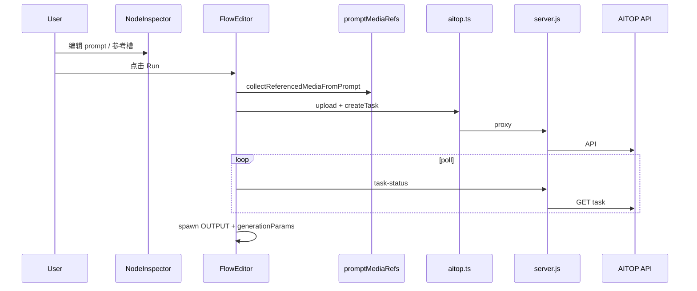

# FlowGen AI Studio — 功能逻辑参考

> 配合 [SKILL.md](SKILL.md) 使用。修改具体模块前查对应章节。

---

## 1. 路由与页面

**`App.tsx`**

- Hash 路由：`parseHashRoute()` 解析 `#/workspace/:id` 等
- 未登录 → `#/login`；首次登录强制改密
- `WorkspaceShell`：拉取 workspace JSON，lazy load `FlowEditor`
- `#/legacy`：无服务端项目的离线单用户模式（localStorage）

**权限**

- `utils/flowgenRoles.ts` + `server/flowgen/permissions.mjs`
- Admin：`#/admin/users`、`#/admin/projects`

### 1.1 用户管理（AdminUsersPage）

**文件：** `components/flowgen/AdminUsersPage.tsx`  
**API：** `services/flowgenApi.ts` → `server/flowgen/routes.mjs`

| 能力 | 说明 |
|------|------|
| 分页 | `page`（从 1）、`pageSize`（默认 20）；`total` / `totalPages` 驱动「上一页/下一页」 |
| 统计 | `summary.totalUsers/admins/active/disabled`（全库，不受筛选影响） |
| 筛选 | 权限、中心、**部门**、**基地**、状态；搜索 `q`（用户名/中文名/extendedJson/项目名） |
| 组织字段 | `extendedJson.center`、`department`、`baseLocation`；PATCH 可单独更新 |
| 关联项目 | 列表列只读；`projectsSource: 'aitop'`；编辑弹窗展示 AITOP 分配结果 |
| 导入 | `POST /users/import`；Excel 列名 `部门`/`基地` 映射到 extendedJson |

**性能：** GET `/users` 对 AITOP `fetchAitopProjectRowsForUser` 仅当前页并发；带 `q` 时对筛选前集合先拉项目再过滤。

**兼容：** 历史用户无 `department`/`baseLocation` 时 API 返回空字符串，前端显示 `-`，补填即可。

---

## 2. FlowEditor 画布

**文件：** `components/FlowEditor.tsx`

### 2.1 节点类型（`types.ts` → ReactFlow type）

| NodeType | ReactFlow type | 用途 |
|----------|----------------|------|
| INPUT | inputNode | 输入图/链起点 |
| PROCESSOR | processorNode | 可运行 AI 节点 |
| OUTPUT | outputNode | 生成结果图 |
| MOV | movNode | 生成视频 |
| CHAIN_FOLDER | chainFolderNode | 输入链文件夹 |
| BACKDROP | backdropNode | 背景分组 |

### 2.2 状态

- `nodes` / `edges`：React Flow 图
- `selectedNodeId` → 打开 `NodeInspector`
- `previewNode` → Node Details 弹窗
- `storyboardImages`：左侧分镜条
- refs：`hasUnsavedManualChangesRef`、workspace version、AITOP billing

### 2.3 持久化

**服务端 workspace（多用户）**

- `getWorkspace` / `putWorkspace` via `flowgenApi.ts`
- 写入前 `persistSanitize.ts` 清理 blob、临时字段
- `workspaceMediaPersist.ts` 决定哪些 URL 可存

**本地 JSON**

- File System Access API 或下载 `.json`
- 含 nodes、edges、viewport、storyboard 等

**localStorage**

- 遗留/legacy 模式；键见 `STORAGE_KEY`、`LAST_VIEWPORT_KEY`

### 2.4 运行流水线（processorNode）

大致顺序（各模型分支不同）：

1. 防重入检查
2. 解析 prompt `@` → `collectReferencedMediaFromPrompt` / upload plan
3. 上传参考图/视频到 AITOP（或 mirror 远程 URL）
4. `services/aitop.ts` 创建任务 → 得 `taskId`
5. 伪进度 interval + poll `/task-status` 或 AITOP API
6. `pickMediaResourceUrlFromTaskStatus` 取结果 URL
7. spawn OUTPUT/MOV 节点，写入 `generationParams` 快照
8. 更新源节点 `taskId`、`imagePreview`、status

**关键：** spawn 时把**当时**面板参数复制进 `generationParams`，后续改面板不影响已生成节点的 Details。

### 2.5 Node Details 弹窗

- 打开：`previewNode` 非空
- 展示逻辑委托 `utils/nodeDetailsPreview.ts`
- 下载：`downloadNodePreviewMedia`（批量 + Node Details 共用）→ 先 `downloadByTaskId`，失败或无 taskId 回退 `imagePreview` + `downloadFile`/`proxy-file`；仍失败提示链接过期
- 文件名：`resolveNodeDownloadFilename`（`utils/nodeDownloadFilename.ts`），优先 `customName`（Inspector「Node Name」）
- 批量下载：`handleDownloadSelected` 遍历选中节点

### 2.6 分镜联动

- Chat/Excel 解析 → `storyboardTableSpawn.ts`
- 按模板节点 spawn 下游 processor，着色（绿/黄/红）表时长与模型上限
- `enrichSpawnedStoryboardNode.ts` 补全 prompt、资产引用

---

## 3. CustomNode 节点卡片

**文件：** `components/nodes/CustomNode.tsx`

- 渲染 `imagePreview`（图/视频缩略图）
- 运行状态、进度条
- **下载按钮** `handleDownload`（文件名同 `resolveNodeDownloadFilename`）：
  1. 有 taskId → `/download-task-file`（失败则继续）
  2. blob/data 直 fetch
  3. 远程 URL → `/proxy-file` 或 cors fetch
- 中键拖拽媒体：`middleButtonMediaDrag.ts`

---

## 4. NodeInspector 属性面板

**文件：** `components/NodeInspector.tsx`

### 4.1 结构

- 模型下拉 → 切换时 `modelSwitchPanelIsolation` 保留各模型面板快照
- 各模型独立 tab / 参考槽 / 参数控件
- `@` 下拉：`buildPromptMediaRefLabels` + 项目资产库合并
- 创意描述 textarea：canonical 规范（`@主图` → `@资产:展示名`）

### 4.2 可灵 3.0 Omni

- `klingOmniTab`：multi | instruction | video | frames
- `klingOmniTabConfigs`：每 tab 独立 prompt、参考图/视频/主体
- instruction/video tab：参考视频用 `referenceMovs`；Details 展示需回退 run snapshot
- 视频参考 tab 预览：`InspectorOmniTabVideoPreview`（模块级 memo，防闪动）
- 首尾帧：`FrameDropZone`（模块级 memo）；blob 优先于 COS

### 4.3 Seedance 2.0

- `seedanceGenerationMode`：text | image | reference
- `seedanceTabConfigs` 与顶层字段双写；refresh 时从 tab 快照恢复帧
- reference 模式：主图 + 参考槽，`@资产:名` 下拉

### 4.4 image 2

- 主图 + 最多 2 参考槽（`image2PanelRefs.ts` 压紧、去重）
- 模型切换隔离：`image2PanelSnapshot`

---

## 5. @ 引用系统

**`utils/promptMediaRefs.ts`（~2800 行）**

- `buildPromptMediaRefContextFromNode`：从 NodeData 建上下文
- `buildPromptMediaRefLabels`：Inspector 下拉项（`@资产:名`、`@图片n`）
- `collectReferencedMediaFromPrompt`：解析 prompt → 上传 plan（顺序、URL、label）
- `resolvePromptPlaceholders`：展开 `@` 为可读文本（run 前/展示用）
- `findPromptMediaRefItemForToken`：`@图片2` → 对应槽位

**`utils/referencedMediaRun.ts`**

- 对齐 panel 槽位与 API 字段（Omni elementList、Seedance reference 等）
- 去重、截断（模型上限）

**`utils/referenceImageSlotLabels.ts`**

- 槽位 caption、资产名显示、dedupe key

---

## 6. Node Details 预览构建

**`utils/nodeDetailsPreview.ts`**

| 函数 | 作用 |
|------|------|
| `buildNodeDetailsHeroPreview` | 主图/视频 hero |
| `buildNodeDetailsReferencePreviewList` | 参考图列表 |
| `buildNodeDetailsUsedParametersBlock` | Model / prompt / 比例等 |
| `buildOmniInstructionVideoTabDetailsReferencePreview` | Omni instruction/video tab 参考图回退 |
| `buildOmniMultiTabDetailsReferencePreview` | Omni multi tab 参考 |

**原则**

- 运行节点（PROCESSOR）：Details 对齐**运行时刻 tab 面板**，不合并 dm+dr+gp 三套
- 输出节点（OUTPUT/MOV）：只用 `generationParams`；无快照的旧节点降级展示

---

## 7. AITOP 集成

**`services/aitop.ts`**

- `uploadImage` / `uploadVideo`
- 各模型 `create*Task`
- `getTaskStatus`、Kling subject CRUD
- 请求体 normalization（测试在 `src/test/services/aitop.test.ts`）

**`utils/aitopBilling.ts`**

- 全局 context：`domainAccount`、`scoreProjectId`
- 注入到 AITOP 请求 header/body

**`utils/aitopTaskRecovery.ts` + `hooks/useAiTopRunRecovery.ts`**

- 加载 workspace 后恢复 running 节点、续 poll

**任务状态 URL**

- `utils/taskStatusImageUrl.ts` — 图片字段
- `utils/taskStatusVideoUrl.ts` — 视频字段
- `utils/taskStatusMediaUrl.mjs` — server 用合并版

---

## 8. Server（server.js）

| 路由 | 逻辑 |
|------|------|
| `/flowgen-api/*` | `createFlowgenRouter()` 多用户 API |
| `GET /users` | 分页+筛选；返回 `summary`/`facets`；AITOP 项目按页拉取 |
| `PATCH /users/:id` | 可更新 `role`/`status`/`center`/`department`/`baseLocation` |
| `/proxy-file` `/proxy-image` | axios 流式代理远程媒体 |
| `/download-task-file?taskId=` | fetchTaskStatus → pickMediaResourceUrl → 流式下载 |
| `/task-status` | AITOP 任务状态 relay |
| `/mirror-media-to-aitop` | 远程 URL 镜像到 AITOP COS |
| `/aitop-llm-see` | LLM SSE 代理（Chat） |
| `/flowgen-expand-prompt` | prompt 扩写 |

**开发环境：** `vite.config.ts` 内联 middleware 模拟 proxy/download（须与 server.js 行为一致）

**Flowgen API 模块：** `server/flowgen/`

- `routes.mjs` — 路由
- `store.mjs` / `store-mysql.mjs` / `relationalStore.mjs` — 存储
- `workspacePerUser.mjs` — 每用户 workspace 切片
- `aitopProjectSync.mjs` — 登录/列表时同步 AITOP 项目

---

## 9. Chat / LLM

**`components/ChatPanel.tsx`**

- 模型：gemini-3-pro、claude-4.5、qwen
- 流式 SSE → `assistantMessageLayout.ts` 解析 thinking / web search / 正文
- 联网检索二次总结、tip 误检索剔除
- 分镜表 spawn 回调注入 FlowEditor
- 聊天历史：`chatStorageScope.ts` + server chat-history API

**`utils/projectSkill.ts`**

- 项目级 skill hint 注入 system prompt

---

## 10. 项目与资产

**`components/flowgen/ProjectListPage.tsx`**

- 项目列表（AITOP 同步，禁止手动 create 非 AITOP 项目）
- 封面：⋮ → 修改封面（`canManageAssignedProject` / `canManageProjectCover`）

**项目封面与项目级管理权限**

| 角色 | 范围 |
|------|------|
| `super_admin` / `admin` | 所有 AITOP 同步到的项目 |
| `project_admin` | 仅 `members` 表中已分配的项目 |
| `user` | 资产只读；封面不可改 |

- 统一服务端判断：`canManageInAssignedProject(store, user, projectId)`
- 封面：`POST /cover` → `canManageProjectCover`
- 资产库：`canManageProjectAssets`
- Skill：`PATCH /projects/:id` → `canManageProject`（含 project_admin 已分配项目 + owner/editor）
- **禁止** workspace 保存自动改封面
- 测试：`npm run test:project-cover`

**`components/flowgen/ProjectAssetLibrary.tsx`**

- 资产上传、episode/sequence、Kling 主体分类
- 资产 URL：`/flowgen-api/projects/:id/assets/:assetId/file`

**`utils/projectAssetPreview.ts`**

- 资产 token、`resolveDisplayMediaUrl`

---

## 11. 媒体与预览

| 工具 | 用途 |
|------|------|
| `canvasLocalPreview.ts` | blob/data URL 显示 |
| `hydratePersistedNodePreviews.ts` | 加载后恢复预览 |
| `localNodeMediaStore.ts` | IndexedDB 本地 blob |
| `imageCompress.ts` | 预览压缩 |
| `canvasPreviewLod.ts` | 缩放 LOD |
| `videoPosterQueue.ts` | 视频中间帧截图为 poster |
| `remoteMediaFetch.ts` | 何时走同源 proxy |

---

## 12. 数据流图

### 运行 → 输出



### 下载

```mermaid
flowchart TD
  A[点击下载] --> B{有 taskId?}
  B -->|是| C[/download-task-file]
  C -->|200| D[保存 blob + customName 文件名]
  C -->|404/失败| E[imagePreview URL]
  B -->|否| E
  E --> F{blob/data?}
  F -->|是| G[直接 fetch]
  F -->|否| H[/proxy-file 或 CORS]
  H -->|失败| I[提示：链接可能已过期，请重新运行节点]
```

---

## 13. 测试脚本对照

| 脚本 | 验证点 |
|------|--------|
| `node-details-simulation-test.ts` | Details 快照 vs 面板，Omni/Seedance/image2 边界 |
| `panel-ref-media-simulation-test.ts` | 运行后面板 @ 与槽位一致 |
| `comprehensive-prompt-ref-delivery-test.ts` | 全模型 @ 扫描/展开/高亮 + 分镜 prompt |
| `inspector-at-mention-e2e-test.ts` | @ 下拉、canonical、plan |
| `image2-panel-refs-test.ts` | image2 槽压紧与快照隔离 |
| `storyboard-table-spawn-test.mjs` | 表头、时长色、模板资产校验 |
| `all-models-final-test.ts` | 每模型 panel + details 矩阵 |
| `project-json-node-details-test.ts` | 真实项目 JSON 回归（含历史 data URL 节点） |
| `assistant-message-layout-test.ts` | Chat 消息分区/总结 |
| `chat-pipeline-regression-test.ts` | Chat 离线管线 |
| `persist-sanitize-test.mjs` | 保存前 sanitize |
| `workspace-persistence-test.mjs` | 工作区 version / 冲突 |
| `nodeDownloadFilename.test.ts` | 下载文件名 customName / imageName / label 优先级 |
| `project-cover-policy-test.mjs` | 封面仅管理员上传；workspace 不自动改封面 |

---

## 14. 易错点速查

| 症状 | 常见原因 | 查 |
|------|----------|-----|
| Node Details 参考图空 | 只读 panel 槽未读 generationParams | `nodeDetailsPreview.ts` Omni instruction/video |
| 首尾帧闪动 | Inspector 内联组件 | 提取模块级 + memo |
| 进度一直 0% | 仅 poll 内更新进度 | Omni run 外层 interval |
| 下载 404 | server 只读 resourceUrl | `taskStatusMediaUrl.mjs` |
| 视频批量下载报缺 taskId | 旧版硬拦截（已移除） | 应回退 proxy；仍失败提示重跑节点 |
| 下载名不对 | 未读 customName | `utils/nodeDownloadFilename.ts` |
| 用户管理缺部门/基地列 | 浏览器缓存旧 `dist` JS | Ctrl+F5；确认 `index-*.js` 已更新 |
| 部门筛选无选项 | 尚无用户填写部门 | 编辑用户补全后 `facets.departments` 才有值 |
| @ 上传顺序错 | plan 与 panel 槽不一致 | `referencedMediaRun.ts` |
| 分镜 spawn 失败 | 模板用 blob | 换资产库 URL |
| 保存后预览丢 | URL 不可持久化 | `workspaceMediaPersist.ts` |
| 封面被画布参考图覆盖 | workspace 自动 sync 封面（已禁用） | 勿恢复 `syncProjectCoverFromWorkspaceGraph` |
| Chat 正文被拆进思考 | 语言检测 | `assistantMessageLayout.ts` |
