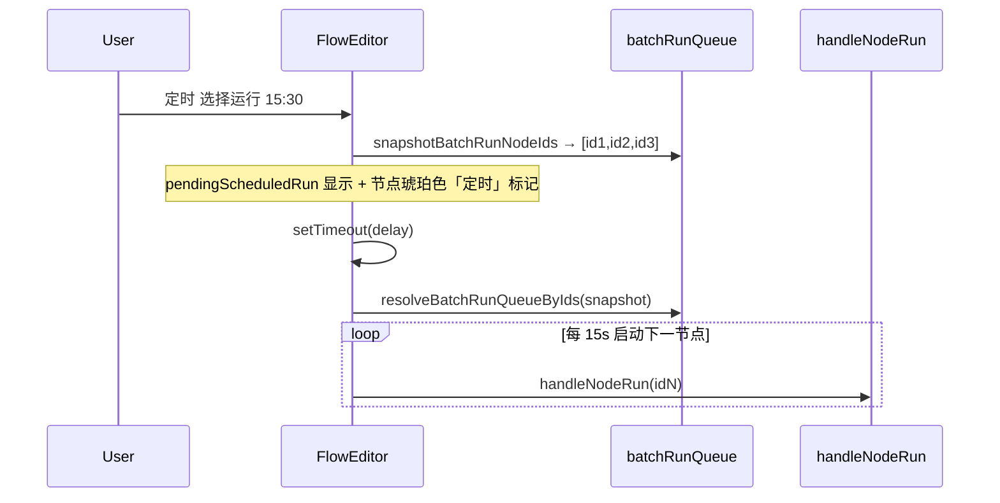
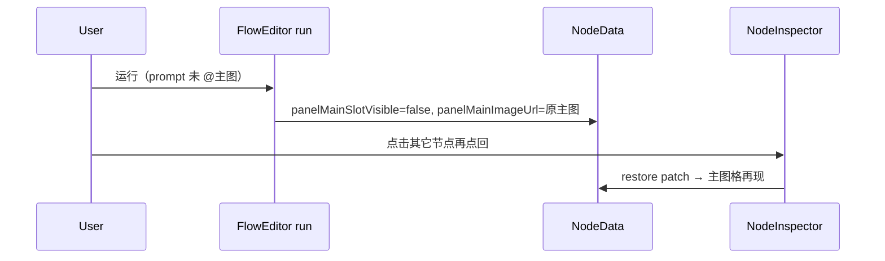
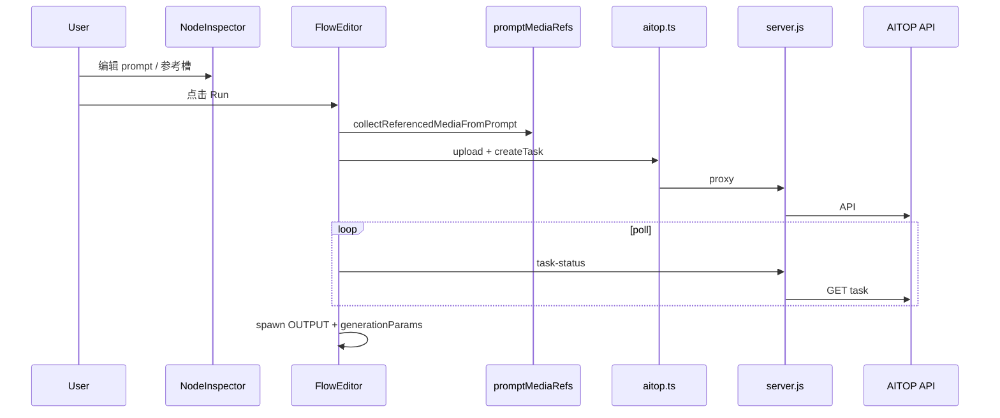
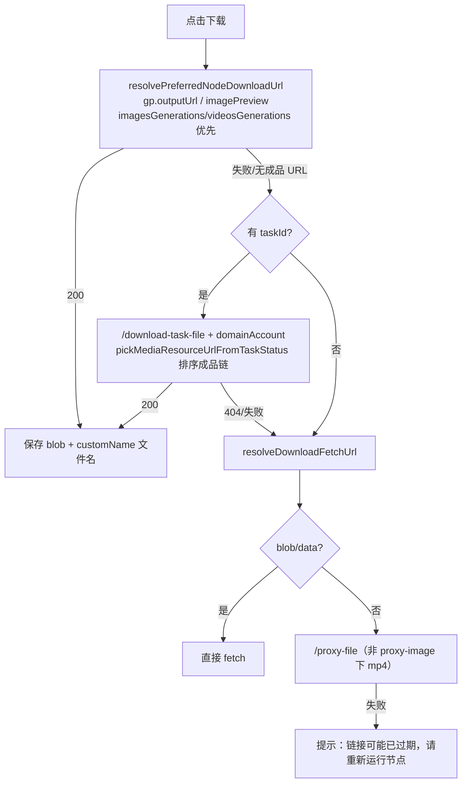

# FlowGen AI Studio — 功能逻辑参考

> 配合 [SKILL.md](SKILL.md) 使用。修改具体模块前查对应章节。

---

## 1. 路由与页面

**`App.tsx`**

- Hash 路由：`parseHashRoute()` 解析 `#/workspace/:id` 等
- 未登录 → `#/login`；首次登录强制改密
- `WorkspaceShell`：拉取 workspace JSON，lazy load `FlowEditor`
- `#/legacy`：无服务端项目的离线单用户模式（localStorage）

**权限**

- `utils/flowgenRoles.ts` + `server/flowgen/permissions.mjs`
- Admin：`#/admin/users`、`#/admin/projects`

### 1.1 用户管理（AdminUsersPage）

**文件：** `components/flowgen/AdminUsersPage.tsx`  
**API：** `services/flowgenApi.ts` → `server/flowgen/routes.mjs`

| 能力 | 说明 |
|------|------|
| 分页 | `page`（从 1）、`pageSize`（默认 20）；`total` / `totalPages` 驱动「上一页/下一页」 |
| 统计 | `summary.totalUsers/admins/active/disabled`（全库，不受筛选影响） |
| 筛选 | 权限、中心、**部门**、**基地**、状态；搜索 `q`（用户名/中文名/extendedJson/项目名） |
| 组织字段 | `extendedJson.center`、`department`、`baseLocation`；PATCH 可单独更新 |
| 关联项目 | 列表列只读；`projectsSource: 'aitop'`；编辑弹窗展示 AITOP 分配结果 |
| 导入 | `POST /users/import`；Excel 列名 `部门`/`基地` 映射到 extendedJson |

**性能：** GET `/users` 对 AITOP `fetchAitopProjectRowsForUser` 仅当前页并发；带 `q` 时对筛选前集合先拉项目再过滤。

**兼容：** 历史用户无 `department`/`baseLocation` 时 API 返回空字符串，前端显示 `-`，补填即可。

---

## 2. FlowEditor 画布

**文件：** `components/FlowEditor.tsx`

### 2.1 节点类型（`types.ts` → ReactFlow type）

| NodeType | ReactFlow type | 用途 |
|----------|----------------|------|
| INPUT | inputNode | 输入图/链起点 |
| PROCESSOR | processorNode | 可运行 AI 节点 |
| OUTPUT | outputNode | 生成结果图 |
| MOV | movNode | 生成视频 |
| CHAIN_FOLDER | chainFolderNode | 输入链文件夹 |
| BACKDROP | backdropNode | 背景分组 |

### 2.2 状态

- `nodes` / `edges`：React Flow 图
- `selectedNodeId` → 打开 `NodeInspector`（**BACKDROP 除外**，见 §2.8）
- `previewNode` → Node Details 弹窗
- `storyboardImages`：左侧分镜条
- refs：`hasUnsavedManualChangesRef`、workspace version、AITOP billing

### 2.3 持久化

**服务端 workspace（多用户）**

- `getWorkspace` / `putWorkspace` via `flowgenApi.ts`
- 写入前 `persistSanitize.mjs`（服务端 `routes.mjs` 调 `sanitizeWorkspacePayload`）清理 blob、临时字段
- **thumbnail 瘦身：** `generatedThumbnails` 项已有 `http(s)` 或 `/flowgen-api/` 的 `url` 时删除 `posterDataUrl`（2026-06）
- `workspaceMediaPersist.ts` 决定哪些 URL 可存

**本地 JSON**

- File System Access API 或下载 `.json`
- 含 nodes、edges、viewport、storyboard 等

**localStorage**

- 遗留/legacy 模式；键见 `STORAGE_KEY`、`LAST_VIEWPORT_KEY`

### 2.4 运行流水线（processorNode）

大致顺序（各模型分支不同）：

1. 防重入检查
2. 解析 prompt `@` → `collectReferencedMediaFromPrompt` / upload plan
3. 上传参考图/视频到 AITOP（或 mirror 远程 URL）
4. `services/aitop.ts` 创建任务 → 得 `taskId`
5. 伪进度 interval + poll `/task-status` 或 AITOP API
6. `pickMediaResourceUrlFromTaskStatus` 取结果 URL
7. spawn OUTPUT/MOV 节点，写入 `generationParams` 快照
8. 更新源节点 `taskId`、`imagePreview`、status

**关键：** spawn 时把**当时**面板参数复制进 `generationParams`，后续改面板不影响已生成节点的 Details。

### 2.5 Node Details 弹窗

- 打开：`previewNode` 非空
- 展示逻辑委托 `utils/nodeDetailsPreview.ts`
- 下载：`downloadNodePreviewMedia`（批量 + Node Details 共用）→ **优先 `resolvePreferredNodeDownloadUrl`（gp.outputUrl / 画布 imagePreview，imagesGenerations/videosGenerations 优先于 openApi）** → 失败回退 `downloadByTaskId` → 仍失败回退 `downloadFile`/`proxy-file`；提示链接过期
- 文件名：`resolveNodeDownloadFilename`（`utils/nodeDownloadFilename.ts`），优先 `customName`（Inspector「Node Name」）
- 批量下载：`handleDownloadSelected` 遍历选中节点

### 2.6 分镜联动

- Chat/Excel 解析 → `storyboardTableSpawn.ts`
- 按模板节点 spawn 下游 processor，着色（绿/黄/红）表时长与模型上限
- `enrichSpawnedStoryboardNode.ts` 补全 prompt、资产引用

### 2.7 批量与定时运行

**文件：** `utils/batchRunQueue.ts`（队列纯函数）+ `FlowEditor.tsx`（UI 与编排）

**两个按钮（结构相同：左立即 / 右 ▼ 定时）：**

| 按钮 | 函数 | 入队条件 |
|------|------|----------|
| 选择运行 | `collectSelectedRunQueue` | 选中 + INPUT/PROCESSOR + 有 prompt + 非 running |
| 全部运行 | `collectStoryboardGreenRunQueue` | `spawnHighlight==='green'` + 有 prompt + 无 OUTPUT/MOV 下游 + 非 running |

按钮旁 `(N)` 为当前可运行数量；全部运行 **不是** 画布上全部 processor。

**立即运行：** `runSelectedFlow` / `runFlow` → 确认框 → `runStaggeredQueue(queue, kind)`。

**定时运行：**

```
用户选时间 → snapshotBatchRunNodeIds（锁定 nodeIds）
  → setTimeout → runFlow/runSelectedFlow({ skipConfirm, fixedNodeIds })
  → resolveBatchRunQueueByIds（不依赖 selected 标志）
  → runStaggeredQueue
```

- `BATCH_RUN_NODE_INTERVAL_MS = 15000`：队列内每 15s **启动**下一节点（上一节点可仍在 poll，并行）
- `selectedBatchNamingPrevRef`：选择运行队列中 MOV 命名继承上一节点
- `stopExecutionRef`：运行中「停止」按钮置位，中断后续启动
- 刷新/关页：定时任务丢失（未持久化到 workspace）

**运行中进度 overlay（`isGlobalRunning`，`FlowEditor.tsx` ~14456）：**

| 属性 | 值 |
|------|-----|
| 位置 | 画布左上角 `absolute top-4 left-4`（勿顶中，会挡右上工具栏） |
| 数据 | `batchRunProgress { current, total }` + `batchRunKind`（`selected` \| storyboard） |
| 交互 | `pointer-events-none`；ESC → `stopExecutionRef` |
| 文案 | `选择运行 N/M（间隔 15s）` / `分镜队列 N/M` / 收尾中 |

**导出 API（`batchRunQueue.ts`）：**

- `collectSelectedRunQueue` / `collectStoryboardGreenRunQueue`
- `snapshotBatchRunNodeIds` / `resolveBatchRunQueueByIds`
- `simulateStaggeredBatchRun`（测试用）



### 2.8 背景框（Backdrop）

**文件：** `components/nodes/BackdropNode.tsx`、`FlowEditor.tsx`

| 项 | 说明 |
|----|------|
| 创建 | 框选节点 → 画布空白右键「创建背景框」 |
| 属性面板 | **不打开** NodeInspector（`shouldOpenInspectorForNode`） |
| 组名 | 框体中心大字；`ResizeObserver` 随框缩放字号 |
| 重命名 | 双击中心；编辑 input **内联**深底浅字（`#0f172a` / `#f8fafc`） |
| 拖动/缩放 | 带动 `backdropChildIds`；四角 resize 后刷新几何归属 |

### 2.9 画布快捷键（摘要）

| 按键 | 行为 |
|------|------|
| Esc | 中断运行、关预览 |
| Ctrl/Cmd+Z / Shift+Z / Y | 撤销/重做 |
| Ctrl/Cmd+C / V | 复制/粘贴节点 |
| L | 自动布局 |
| F | 聚焦选中 |
| Backspace/Delete | 删节点 |

背景框创建无专用快捷键；详见 `docs/CORE_APPLICATION_LOGIC.md` §10。

---

## 3. CustomNode 节点卡片

**文件：** `components/nodes/CustomNode.tsx`

- 渲染 `imagePreview`（图/视频缩略图）
- 运行状态、进度条
- **下载按钮** `handleDownload`（文件名同 `resolveNodeDownloadFilename`）：
  1. **优先** `resolvePreferredNodeDownloadUrl(data)`（gp.outputUrl / imagePreview；imagesGenerations/videosGenerations 优先于 openApi）
  2. 失败回退 taskId → `buildDownloadTaskFileUrl` → `/download-task-file`（含 `domainAccount`）
  3. 仍失败回退 `resolveDownloadFetchUrl` → blob/data 或 `/proxy-file`（视频勿走 `/proxy-image`）
- 中键拖拽媒体：`middleButtonMediaDrag.ts`

---

## 4. NodeInspector 属性面板

**文件：** `components/NodeInspector.tsx`

### 4.1 结构

- 模型下拉 → 切换时 `modelSwitchPanelIsolation` 保留各模型面板快照
- 各模型独立 tab / 参考槽 / 参数控件
- `@` 下拉：`buildPromptMediaRefLabels` + 项目资产库合并；首尾帧须与 `flMediaCaptions` 一致
- 创意描述 textarea：canonical 规范（`@主图` → `@资产:展示名`；首尾帧泛称保留或与资产名对齐）
- 首尾帧区：`FrameDropZone`（模块级 memo）；`fallbackMainPreview`；**勿**在左上角重复 `[首帧图]` badge（底栏 caption 即可）

### 4.2 可灵 3.0 Omni

- `klingOmniTab`：multi | instruction | video | frames
- `klingOmniTabConfigs`：每 tab 独立 prompt、参考图/视频/主体
- instruction/video tab：参考视频用 `referenceMovs`；Details 展示需回退 run snapshot
- 视频参考 tab 预览：`InspectorOmniTabVideoPreview`（模块级 memo，防闪动）
- 首尾帧：`FrameDropZone`（模块级 memo）；blob 优先于 COS

### 4.3 Seedance 2.0

- `seedanceGenerationMode`：text | image | reference
- `seedanceTabConfigs` 与顶层字段双写；refresh 时从 tab 快照恢复帧
- reference 模式：主图 + 参考槽，`@资产:名` 下拉

### 4.4 image 2（OPEN_AI_GPT_IMAGE_2）

**文件：** `utils/image2Model.ts`、`utils/image2PanelRefs.ts`、`NodeInspector.tsx`、`services/aitop.ts`

| 项 | 值 |
|----|-----|
| 参考图上限 | **4** 张（`IMAGE2_MAX_API_IMAGES`）；面板 4 格 grid |
| 有主图格 | 1 主图 + 3 参考；无主图格 → 4 参考 |
| 画面比例 | 10 种：`1:1` `5:4` `9:16` `21:9` `16:9` `4:3` `3:2` `4:5` `3:4` `2:3`（`IMAGE2_ASPECT_TO_SIZE`；`image2NormalizeAspectRatio` 未知回退 1:1） |
| 图像尺寸 | 每比例 1 canonical + `auto`（16:9 → `1536x864`/`auto`）；`image2MigrateLegacyImageSize` 迁移旧 2048/3840 |
| API `size` | `1024x1024` `1520x1216` `864x1536` `1456x624` `1536x864` `1536x1152` `1536x1024` `1216x1520` `1152x1536` `1024x1536` `auto`；同时带 `aspectRatio` |
| 实际输出 | API 可能不严格按 size 出像素；`generationParams.outputImageSize` 探测成品 PNG IHDR |
| 模型切换 | `image2MainPatchOnModelSwitch` + `image2PanelRefsPatchIfChanged` 压紧槽 |

**测试：** `npm run test:image2-panel-refs`、`npm run test:image2-aspect-size`

### 4.5 多图参考主图：运行后隐藏与重新选中恢复

**适用模型：** Nano Banana 2.0、image 2、可灵3.0 Omni（multi / instruction / video tab）。

**数据字段（`types.ts` → `NodeData`）：**

| 字段 | 说明 |
|------|------|
| `imagePreview` | 画布节点大图 |
| `panelMainSlotVisible` | `undefined` = 编辑态显示主图格；运行后未 @主图 → `false` |
| `panelMainImageUrl` | 运行前主图备份；供重新选中 Inspector 时恢复 |

**运行后写回（`referencedMediaRun.ts`）：**

```text
buildPanelImagePreviewPatchAfterRun(plan, uploaded, { nodeData, mergedPanelRefs, ... })
  ├─ @主图 in plan → imagePreview=上传主图, panelMainSlotVisible=true, 清 panelMainImageUrl
  └─ 未 @主图 → panelMainSlotVisible=false, panelMainImageUrl=运行前 imagePreview
                 imagePreview 可改为首个 @ 参考（画布）；无 @ 时勿清空 imagePreview
```

**重新选中恢复（`NodeInspector.tsx`）：**

```text
useLayoutEffect([nodeId])
  → buildPanelMainImageRestorePatchForEditing(nodeDataRef.current)
  → onUpdate({ panelMainSlotVisible: undefined, imagePreview: panelMainImageUrl? })
```

**展示：** `shouldShowPanelMainImageSlot`；image2 用 `image2ShowMainInRefGrid`；Omni 用 `omniInspectorShowMainImageSlot`。

**FlowEditor 持久化：** `runCaptureForGp` 含 preview patch → `buildUpdatedRunNodeData` 写回 `panelMainImageUrl`。

**测试：** `panel-ref-media-simulation-test.ts` → `=== 12a-restore ===`



### 4.6 面板换图后运行：勿恢复旧 @资产 库图（§12b）

**症状：** 用户删掉/替换图片1/2 并拖入新图，点击运行后面板又显示资产库旧图。

**根因：** `resolveProjectAssetUrlForPromptToken(panelUrl, libUrl)` 在 `libUrl` 存在时曾始终返回库 URL；`collectReferencedMediaFromPrompt` 仅传 `slugMap` 时 `@资产:` 分支也会误用库图。

**规则（`promptMediaRefs.ts`，2026-06）：**

| 场景 | 用哪个 URL |
|------|------------|
| 面板槽 URL 与资产库 **同一 asset**（key 一致） | 面板 URL |
| 面板是 **有效 http(s)** 且用户已换图（与库 COS 不同） | **面板 URL** |
| 面板是 **blob/data** 或 aitop COS 与库不一致（误拖） | 资产库 URL |
| `@图片n` | 始终读面板槽（不受 `@资产:` bug 影响） |

**注意：** 运行前 `buildCanonicalInspectorPromptPatch` 可能把 `@图片n` 写成 `@资产:旧名`，解析仍须走上述 `resolveProjectAssetUrlForPromptToken`。

**测试：** `npm run test:panel-swap-all`；`panel-ref-media-simulation-test.ts` §12a-swap

---

## 5. @ 引用系统

**目标：** 面板里看到的素材、@ 下拉里选的 token、运行上传的 URL、发给模型的 prompt 说明，四者一致。

### 5.1 核心文件

| 文件 | 职责 |
|------|------|
| `utils/promptMediaRefs.ts` | 下拉项、token 扫描、plan 解析、prompt 展开 |
| `utils/referencedMediaRun.ts` | 上传、首尾帧 API 槽位、运行后面板合并（**保留全部槽**，仅写回 @ 槽 URL） |
| `utils/referenceImageSlotLabels.ts` | 槽位底栏 caption、URL、资产名 |
| `utils/firstFramePanel.ts` | 首帧模型识别、默认填充、预览 URL |
| `components/NodeInspector.tsx` | `FrameDropZone`、`flMediaCaptions`、`inspectorMainPreviewFallback` |

### 5.1 产品铁律（2026-07-03）

| 层 | 规则 |
|----|------|
| **面板** | 运行后保留**全部**已拖入槽；未 @ 的不裁剪 |
| **Node Details（OUTPUT/MOV）** | 只读 `generationParams`，**仅**当次 prompt @ 到的图/视频/音频 |
| **@ 下拉** | 当前面板已有槽（含运行后新拖入） |
| **API** | 仅 plan 中 @ 到的 token |

**门禁：** `npm run test:panel-partial-ref`（245 项，已并入 `test:gate`）+ `test:model-contract`。

### 5.2 面板 ↔ @ 下拉（编辑态）

- `buildPromptMediaRefLabels` → `buildInspectorPromptMentionItems`：仅列出**当前面板已有**素材
- **UI @ 下拉禁止** `mergeInspectorAtMentionItems(projectAssetRefItems)` 合并全库（`mergeInspectorAtMentionItems` 仅工具函数/测试保留）
- `inspectorMentionDisplayNameForItem`：展示名与底栏 caption 一致（主图/首帧图/尾帧图/资产名）
- `mentionInsertTextForPanelCaption`：caption → insertText（资产名 → `@资产:名`，泛称 → `@首帧图` 等）
- `pushFrameMentionFromPanel`：用 `resolvedFramePanelUrl` 写入下拉；无 stored URL 时临时注入再 `maybePushFramePreview`

**首帧回退（易漏）：**

```text
effectiveFirstFramePanelUrl(data, ctx)
  = firstFrameImageUrl || firstFrameImage
  ||（首尾帧模型 && 有主预览）imagePreview
```

仅拖尾帧、首帧格显示主图时，下拉与 plan 都必须走上述回退，不能只判断 `firstFrameLocalRef` 有无 URL。

### 5.2.1 创意描述输入框（NodeInspector）

| 用户操作 | 实现 | 禁止 |
|----------|------|------|
| Ctrl+V 粘贴 | `handlePromptPaste` 纯文本 + `setPromptByContext` | 自动 `buildScanPromptAndPanelPatch` |
| 输入 `@` | `buildInspectorPromptMentionItems` 面板槽；下拉 DOM `top-0` | 合并全库；`bottom-1` 贴底 |
| 点「扫描 @素材」 | `buildScanPromptAndPanelPatch` + 清粘贴守卫 | `useLayoutEffect` 自动 scan |
| **右键「复制描述（纯文本）」** | `stripPromptMediaTokensForPlainCopy` 去掉 `@` 引用 token | 复制含 `@资产:` 原文 |
| 粘贴后删除/扫描后编辑 | `pendingPastePromptRef` 不匹配时解除守卫 | 永久 `return` 拦截 onChange |
| Chat 发送到节点 | `buildNodePromptUpdatePatch` 同步 tab 字段 | 只写 `prompt` |

**tab 字段映射（`getNodeInspectorPromptText` / `buildNodePromptUpdatePatch`）：**

- 可灵3.0 Omni：`klingOmniMultiPrompt` / `Instruction` / `Video` / `FramesPrompt`
- Seedance 2.0：`seedanceTabConfigs[text|image|reference].prompt`
- 其它模型：顶层 `prompt`

**测试：** `npm run test:prompt-asset-scan`、`npm run test:prompt-edit-matrix`

### 5.3 创意描述 → 上传 plan（运行态）

- `matchAllPromptMediaTokens`：支持无空格 `@资产:名后文` 边界识别
- `collectReferencedMediaFromPrompt`：按出现顺序收集；每项含 `token`、`url`、`label`、`refFrameIndex?`、`refImageSlotIndex?`
- `resolveRefFrameIndexForCollectedToken`：
  - `@首帧图`/`@主图`/`@图片1` → `0`
  - `@尾帧图`/`@图片2` → `1`
  - `@资产:名` → 查 `buildPromptMediaRefLabels` 中 `refFrameIndex`
- `resolveSeedancePromptTokenMedia`：`@首帧图` 用 `effectiveFirstFramePanelUrl`（与面板一致）

### 5.4 API 首尾帧槽位

**`referencedMediaRun.ts`**

- `START_FRAME_REF_TOKENS` / `END_FRAME_REF_TOKENS`：显式 token 集合
- `assignStartEndUrlsFromImagePlan`：**同时**认 `refFrameIndex` 与上述 token（Seedance 图生等）
- `buildFirstLastFramePanelPatchFromPlan`：仅 @ 到的帧保留，未 @ 的清空
- `uploadReferencedImageEntry`：`@首帧图` 可回退 `originals.main` / `originals.firstFrame`

**`FlowEditor.tsx` 可灵/vidu 分支：** 首帧/尾帧 URL 从 plan 取；循环须认 `entry.refFrameIndex`（不仅 `@尾帧图`）

### 5.5 Prompt 展开（模型可读）

- `buildReferenceIndexOptionsFromPlan`：`@token` → `[图N]` 序号
- `resolvePromptPlaceholders`：替换为「对应本请求首帧/尾帧/referenceImages 第 N 项」
- `buildPromptTokenPhraseMap`：`@资产` + `refFrameIndex===0` 时仍注册 `@首帧图` 别名短语
- 运行前 `getCanonicalInspectorPromptText` / `remapPromptFrameTokensToAssetTokens`：可读性规范，不改变 plan URL 解析

### 5.6 数据流（@ 专项）

```mermaid
flowchart LR
  Panel[面板槽 + 底栏 caption]
  Drop[@ 下拉 insertText]
  Prompt[创意描述 @token]
  Plan[collectReferencedMediaFromPrompt]
  API[upload + start/end URL]
  Expand[resolvePromptPlaceholders]

  Panel --> Drop
  Drop --> Prompt
  Prompt --> Plan
  Plan --> API
  Plan --> Expand
  Expand --> Task[aitop createTask prompt]
  API --> Task
```

---

## 6. Node Details 预览构建

**`utils/nodeDetailsPreview.ts`**

| 函数 | 作用 |
|------|------|
| `buildNodeDetailsHeroPreview` | 主图/视频 hero |
| `buildNodeDetailsReferencePreviewList` | 参考图列表 |
| `buildNodeDetailsUsedParametersBlock` | Model / prompt / 比例等 |
| `buildOmniInstructionVideoTabDetailsReferencePreview` | Omni instruction/video tab 参考图回退（MOV 须传 `prompt`，因 tab 字段可能空） |
| `buildOmniMultiTabDetailsReferencePreview` | Omni multi tab 参考（面板/top refs 与 gp 冲突时优先面板；`restoreOmniMultiPanelFromSnapshot` 勿把生成结果当主图） |
| `buildOmniPanelSourceForNodeDetails` | OUTPUT/MOV 面板源：gp 首帧 + **同 task** ancestor 合并空 Omni 槽 + tab prompt |
| `ancestorOmniPanelMergeAllowedForDetails` | 双方 taskId 一致才允许从 ancestor merge 参考槽（旧 MOV 防 INPUT 污染） |

**原则**

- 运行节点（PROCESSOR）：Details 对齐**运行时刻 tab 面板**，不合并 dm+dr+gp 三套
- 输出节点（OUTPUT/MOV）：以 `generationParams` 为主；Omni 面板槽/标签从**同 task 直接上游 OUTPUT** 补齐（`FlowEditor.resolveNearestInputAncestorData`），勿 BFS 到 INPUT 冒充面板

---

## 7. AITOP 集成

**`services/aitop.ts`**

- `uploadImage` / `uploadVideo`
- 各模型 `create*Task`
- `getTaskStatus`、Kling subject CRUD
- 请求体 normalization（测试在 `src/test/services/aitop.test.ts`）

**`utils/aitopBilling.ts`**

- 全局 context：`domainAccount`、`scoreProjectId`
- 注入到 AITOP 请求 header/body
- **`buildDownloadTaskFileUrl(taskId)`** — 下载中转与 `/task-status` 同参

**`utils/aitopTaskRecovery.ts` + `hooks/useAiTopRunRecovery.ts`**

- 加载 workspace 后恢复 running 节点、续 poll

**任务状态 URL**

- `utils/taskStatusImageUrl.ts` — 图片字段
- `utils/taskStatusVideoUrl.ts` — 视频字段
- `utils/taskStatusMediaUrl.mjs` — server 用合并版

---

## 8. Server（server.js）

| 路由 | 逻辑 |
|------|------|
| `/flowgen-api/*` | `createFlowgenRouter()` 多用户 API |
| `GET /users` | 分页+筛选；返回 `summary`/`facets`；AITOP 项目按页拉取 |
| `PATCH /users/:id` | 可更新 `role`/`status`/`center`/`department`/`baseLocation` |
| `/proxy-file` `/proxy-image` | axios 流式代理远程媒体 |
| `/download-task-file?taskId=&domainAccount=` | `fetchTaskStatusWithRetry(taskId, domainAccount)` → pickMediaResourceUrl → 流式下载 |
| `/task-status` | AITOP 任务状态 relay |
| `/mirror-media-to-aitop` | 远程 URL 镜像到 AITOP COS |
| `/aitop-llm-see` | LLM SSE 代理（Chat） |
| `/flowgen-expand-prompt` | prompt 扩写 |

**开发环境：** `vite.config.ts` 内联 middleware 模拟 proxy/download（须与 server.js 行为一致）

**Flowgen API 模块：** `server/flowgen/`

- `routes.mjs` — 路由
- `db.mjs` — MySQL pool、`isMysqlConnectionError`、`isMysqlPacketTooLarge`、`resetPool`、`enableKeepAlive`、连接 init `max_allowed_packet`
- `workspacePayloadCodec.mjs` — workspace JSON gzip 包装/解压（热路径大工程）
- `repos/workspaceRepo.mjs` — 每用户 workspace 切片 PUT/GET（codec + 重试 + 安全 rollback）
- `store.mjs` / `store-mysql.mjs` / `relationalStore.mjs` — 存储
- `workspacePerUser.mjs` — 每用户 workspace 切片
- `aitopProjectSync.mjs` — 登录/列表时同步 AITOP 项目

### 8.1 MySQL workspace 保存稳定性

**PUT `/projects/:id/workspace`（relational 模式）** → `sanitizeWorkspacePayload` → `workspaceRepo.putUserWorkspaceSlice`

**编解码（`workspacePayloadCodec.mjs`）：**

```
客户端 payload (JSON)
  → sanitizeWorkspacePayload
  → encodeWorkspacePayloadForDb
       ├─ ≤512KB：原样 JSON 写入 MySQL JSON 列
       └─ >512KB：gzip → base64 → { "__flowgen_gzip_v1__": "..." }
  → payload_bytes = 未压缩 UTF-8 长度
GET 时 decodeWorkspacePayloadFromDb 透明解压（旧行无 wrapper 仍兼容）
```

| 层 | 行为 |
|----|------|
| `encodeWorkspacePayloadForDb` | 压缩后仍 >3.5MB → throw `WORKSPACE_PAYLOAD_TOO_LARGE` |
| `putUserWorkspaceSlice` | 最多 3 次尝试；`isMysqlConnectionError` 时 `resetPool()` + 退避 |
| `putUserWorkspaceSliceOnce` | 事务；读/写前 decode/encode；`catch` 内 `rollback`/`finally` `release` 均 try/catch |
| `routes.mjs` | 断连 → **503**；packet/WORKSPACE 过大 → **413**；其它 → **500** JSON，勿 rethrow |
| `server.js` | `unhandledRejection`：MySQL 断连 + packet too large 只打日志 |
| `db.mjs` | 新连接 `SET SESSION max_allowed_packet=67108864`（callback 形式） |

**常见错误码：** `ECONNRESET`、`ECONNABORTED`、`PROTOCOL_CONNECTION_LOST`、`closed state`、`Pool is closed`、`ER_NET_PACKET_TOO_LARGE` (1153)

**与 snapshot 分块：** `store-mysql.mjs` 用 `flowgen_store_chunk` 分块存全库 JSON；workspace 热路径**不分块**，靠 gzip 单行。

**排查：** MySQL 服务是否运行；连接 idle 超时；工程节点/chat 是否膨胀；F12 保存失败看 503 vs 413。

**测试：** `node scripts/workspace-payload-codec-test.mjs`、`node scripts/persist-sanitize-test.mjs`

---

## 9. Chat / LLM

**`components/ChatPanel.tsx`**

- 模型：gemini-3-pro、claude-4.5、qwen
- 流式 SSE → `assistantMessageLayout.ts` 解析 thinking / web search / 正文
- 联网检索二次总结、tip 误检索剔除
- 分镜表 spawn 回调注入 FlowEditor
- 聊天历史：`chatStorageScope.ts` + server chat-history API

**`utils/projectSkill.ts`**

- 项目级 skill hint 注入 system prompt

---

## 10. 项目与资产

**`components/flowgen/ProjectListPage.tsx`**

- 项目列表（AITOP 同步，禁止手动 create 非 AITOP 项目）
- 封面：⋮ → 修改封面（`canManageAssignedProject` / `canManageProjectCover`）

**项目封面与项目级管理权限**

| 角色 | 范围 |
|------|------|
| `super_admin` / `admin` | 所有 AITOP 同步到的项目 |
| `project_admin` | 仅 `members` 表中已分配的项目 |
| `user` | 资产只读；封面不可改 |

- 统一服务端判断：`canManageInAssignedProject(store, user, projectId)`
- 封面：`POST /cover` → `canManageProjectCover`
- 资产库：`canManageProjectAssets`
- Skill：`PATCH /projects/:id` → `canManageProject`（含 project_admin 已分配项目 + owner/editor）
- **禁止** workspace 保存自动改封面
- 测试：`npm run test:project-cover`

**`components/flowgen/ProjectAssetLibrary.tsx`**

- 资产上传、episode/sequence、Kling 主体分类
- 资产 URL：`/flowgen-api/projects/:id/assets/:assetId/file`

**`utils/projectAssetPreview.ts`**

- 资产 token、`resolveDisplayMediaUrl`

---

## 11. 媒体与预览

| 工具 | 用途 |
|------|------|
| `canvasLocalPreview.ts` | blob/data URL 显示 |
| `hydratePersistedNodePreviews.ts` | 加载后恢复预览 |
| `localNodeMediaStore.ts` | IndexedDB 本地 blob（主图、首尾帧、参考图、Omni 视频） |
| `hydratePanelReferenceLocalRefs.ts` | 刷新后从 IndexedDB 恢复面板参考图 / 主图格备份 |
| `imageCompress.ts` | 预览压缩 |
| `canvasPreviewLod.ts` | 缩放 LOD |
| `videoPosterQueue.ts` | 视频中间帧截图为 poster |
| `remoteMediaFetch.ts` | 何时走同源 proxy；`resolveDownloadFetchUrl`（video 改 proxy-file） |
| `canvasRefreshPause.ts` | 画布暂停刷新全局态；Phase1 poster/LOD；Phase2 可选 side-effect 暂停 |

### 11.1 画布暂停刷新

**UI：** `App.tsx` → `CanvasRefreshHeaderControls`（工程名行，Save/New/Open 旁）

**Phase 1：** `setCanvasRefreshPaused` / `getCanvasRefreshPaused`；非选中节点暂停 poster、缩略图 strip、LOD；pan/zoom 时 `setCanvasViewportMoving` 降 LOD。

**Phase 2（高级）：** `canvasPerfAdvanced` — 暂停 history 深拷贝、workspace 自动保存、Inspector 同步（复用 `isGraphSideEffectPaused`）。

**CustomNode：** 监听 `flowgen:canvas-refresh-paused`；`shouldDeferVideoDecodeWhenPaused`。

**恢复：** `hydratePersistedRemotePreviews()` + viewport 刷新。

**测试：** `scripts/canvas-refresh-pause-test.ts`

### 11.2 画布交互：中键拖放 / Inspector 锚定 / MiniMap

**Inspector 锚定（Shift 多选）：** `utils/inspectorAnchorSelection.ts` + `utils/inspectorAnchorSession.ts`。Shift+框选时 `preserveAnchor` 保持当前 Inspector 节点；普通单击才更新锚点。`FlowEditor.tsx` `onSelectionChange` / `onNodeClick` 调用。

**中键拖放：** `utils/middleButtonMediaDrag.ts` 发起；`utils/canvasMiddleDrag.ts` 汇总画布多选预览；`utils/inspectorMediaDrop.ts` 解析 HTML5 drop 的 `data-flowgen-media-drop` 分区（`node-main`、`reference`、`first-frame`、`last-frame`）。Alt+中键 = 画布平移，不启动素材拖放。画布投参考槽标签用 `resolvePanelRefLabelForInspectorDrop`（显示「图片n」），同 URL 主图格用 `isPanelRefDuplicateOfMainImageSlot` 拦截。

**MiniMap：** `components/flowgen/FlowgenMiniMap.tsx` + `utils/flowgenMiniMapLayout.ts`。纵向分镜工程用 `computeAdaptiveMiniMapSize` 自适应高度；viewBox 不含 viewport 并集；点击节点居中时保留当前 zoom。

**测试：** vitest `inspectorAnchorSelection` / `inspectorAnchorSession` / `middleButtonMediaDrag` / `canvasMiddleDrag*` / `inspectorMediaDrop` / `panelRefInspectorDropLabel` / `flowgenMiniMapLayout`；烟测 `scripts/minimap-*-smoke.mjs`。

### 11.3 多图生成与 image2 成品像素

**多图生成数：** `utils/panelGenerateCount.ts` — `resolvePanelGenerateCount` 从 `numberOfImages` / `modelConfigs` 解析，默认 1，上限 4。

**并行轮询：** `utils/multiGenerateTasks.ts` — `pollImageTaskUntilUrl` / `pollVideoTaskUntilUrl` 多 taskId 并行。

**image2 实际像素：** `utils/probeRemoteImageDimensions.ts` 运行成功后探测成品 PNG IHDR → `generationParams.outputImageSize`；Node Details 展示时须与请求 `image2ImageSize` 区分。

**测试：** vitest `panelGenerateCount`（含于 `test:gate`）；改 probe 时跑 `test:gate`（含 `image2-aspect-size` + `generatedOutputUrl`）。

---

## 12. 数据流图

### 运行 → 输出



### 下载



---

## 13. 测试脚本对照

| 脚本 | 验证点 |
|------|--------|
| `node-details-simulation-test.ts` | Details 快照 vs 面板，Omni/Seedance/image2 边界 |
| `panel-ref-media-simulation-test.ts` | 运行后面板 @ 与槽位一致；**12a-restore 主图恢复**；**12a-swap 换图** |
| `panel-swap-all-models-tabs-test.ts` | 全模型 tab 换图 + `@资产`/`@图片n`（§12b 专项，44 项） |
| `canvas-refresh-pause-test.ts` | 暂停刷新 LOD / 选中切换 |
| `comprehensive-prompt-ref-delivery-test.ts` | 全模型 @ 扫描/展开/高亮 + 分镜 prompt |
| `prompt-asset-scan-panel-test.ts` | 粘贴/扫描/@ 高亮/Seedance tab 同步 |
| `inspector-prompt-edit-matrix-test.ts` | 全模型/tab 创意描述编辑矩阵 |
| `inspector-at-mention-e2e-test.ts` | @ 下拉、canonical、plan |
| `panel-mention-caption-alignment-test.ts` | 底栏 ↔ @ 下拉 ↔ plan 首尾帧 ↔ API assign |
| `first-frame-panel-default-fill-test.ts` | 首帧默认填充、主图回退展示 |
| `batch-run-schedule-test.ts` | 选择/全部队列、定时快照、stagger 全启动 |
| `image2-panel-refs-test.ts` | image2 四格槽压紧与快照隔离 |
| `image2-model-aspect-size-test.ts` | image2 比例↔尺寸联动、4 图上限 |
| `download-task-simulation-test.ts` | 下载 URL domainAccount、proxy-file 规避 504 |
| `download-result-url-ranking-test.ts` | imagesGenerations/videosGenerations 优先于 openApi；resolvePreferredNodeDownloadUrl |
| `storyboard-table-spawn-test.mjs` | 表头、时长色、模板资产校验 |
| `all-models-final-test.ts` | 每模型 panel + details 矩阵 |
| `project-json-node-details-test.ts` | 真实项目 JSON 回归（含历史 data URL 节点） |
| `assistant-message-layout-test.ts` | Chat 消息分区/总结 |
| `chat-pipeline-regression-test.ts` | Chat 离线管线 |
| `persist-sanitize-test.mjs` | 保存前 sanitize；thumbnail poster 剥离 |
| `workspace-payload-codec-test.mjs` | workspace gzip 编解码 round-trip（`npm run test:workspace-codec`） |
| `workspace-persistence-test.mjs` | 工作区 version / 冲突 |
| `nodeDownloadFilename.test.ts` | 下载文件名 customName / imageName / label 优先级 |
| `project-cover-policy-test.mjs` | 封面仅管理员上传；workspace 不自动改封面 |

---

## 14. 易错点速查

| 症状 | 常见原因 | 查 |
|------|----------|-----|
| Node Details 参考图空 | 只读 panel 槽未读 generationParams | `nodeDetailsPreview.ts` Omni instruction/video |
| 首尾帧闪动 | Inspector 内联组件 | 提取模块级 + memo |
| 进度一直 0% | 仅 poll 内更新进度 | Omni run 外层 interval |
| 下载 404（个别用户） | `/download-task-file` 未带 domainAccount | `buildDownloadTaskFileUrl` + server 透传 |
| 下载 404（任务无资源） | server 只读 resourceUrl / 任务过期 | `taskStatusMediaUrl.mjs` |
| 下载分辨率不对（拿到 openApi 中间链） | taskId 优先 + pickMediaResourceUrlFromTaskStatus 命中 openApi | `resolvePreferredNodeDownloadUrl` + `rankAitopPersistableResultUrl`（imagesGenerations/videosGenerations 优先） |
| 下载名不对 | 未读 customName | `utils/nodeDownloadFilename.ts` |
| 下载 504 / proxy-image mp4 | 视频走 `/proxy-image` 缓冲超时 | `resolveDownloadFetchUrl` → `/proxy-file` |
| 点击背景框弹出属性面板 | `onNodeClick` 未排除 BACKDROP | `shouldOpenInspectorForNode` |
| Backdrop 编辑白底白字 | 全局 input 样式覆盖 | `BackdropNode` input 内联 color/background |
| image2 仅 3 参考 | 旧 `slice(0,3)` | `IMAGE2_MAX_API_IMAGES = 4` 全链路同步 |
| 用户管理缺部门/基地列 | 浏览器缓存旧 `dist` JS | Ctrl+F5；确认 `index-*.js` 已更新 |
| 部门筛选无选项 | 尚无用户填写部门 | 编辑用户补全后 `facets.departments` 才有值 |
| @ 上传顺序错 | plan 与 panel 槽不一致 | `referencedMediaRun.ts` |
| @ 下拉缺首帧、只有尾帧 | `pushFrameMentionFromPanel` 未用 `resolvedFramePanelUrl` | `promptMediaRefs.ts` |
| @首帧图 plan URL 空 | 未用 `effectiveFirstFramePanelUrl` | `resolveSeedancePromptTokenMedia` |
| `@资产:A` + `@资产:B` 尾帧未进 API | plan 无 `refFrameIndex` 或可灵循环未认 | `collectReferencedMediaFromPrompt` + FlowEditor kling 分支 |
| 首帧格有图但 @ 无首帧 | 只读 `firstFrameImageUrl` 忽略主预览回退 | `effectiveFirstFramePanelUrl` |
| 首帧格裂图/空白 | blob 过期或未 default-fill | `firstFramePanel.ts`、`FrameDropZone` |
| 定时只跑 1～2 个 | 到点重新 collect 选中态 / 绿框不足 | `snapshotBatchRunNodeIds` + `fixedNodeIds` |
| 全部运行按钮无 `(N)` | 无绿色可运行分镜 | 分镜表写入时长 → 绿框；且无 OUTPUT 下游 |
| 选择运行定时后 0 个 | 到点选中已取消 | 须用快照 `resolveBatchRunQueueByIds` |
| 分镜 spawn 失败 | 模板用 blob | 换资产库 URL |
| 保存后预览丢 | URL 不可持久化 | `workspaceMediaPersist.ts` |
| 运行后点回源节点主图空 | 未备份/未 restore `panelMainImageUrl` | §4.5、`referencedMediaRun.ts`、`NodeInspector` nodeId effect |
| 换图后运行恢复旧图 | `@资产:` 解析回退资产库 | `resolveProjectAssetUrlForPromptToken`、`resolveSeedancePromptTokenMedia` §12b |
| npm start 随机崩溃 MySQL | rollback 二次抛错或未 503 | `workspaceRepo.mjs`、`routes.mjs`、`db.mjs` |
| workspace 保存 503 | MySQL 断连 / pool closed | §8.1；`isMysqlConnectionError` |
| workspace 保存 413 | payload 压缩后仍超 3.5MB | `workspacePayloadCodec.mjs`；减节点/chat 或调 MySQL |
| 批量运行条挡按钮 | 进度 overlay 在顶中 | 须 `top-4 left-4` + `pointer-events-none`（§2.7） |
| 封面被画布参考图覆盖 | workspace 自动 sync 封面（已禁用） | 勿恢复 `syncProjectCoverFromWorkspaceGraph` |
| Chat 正文被拆进思考 | 语言检测 | `assistantMessageLayout.ts` |
