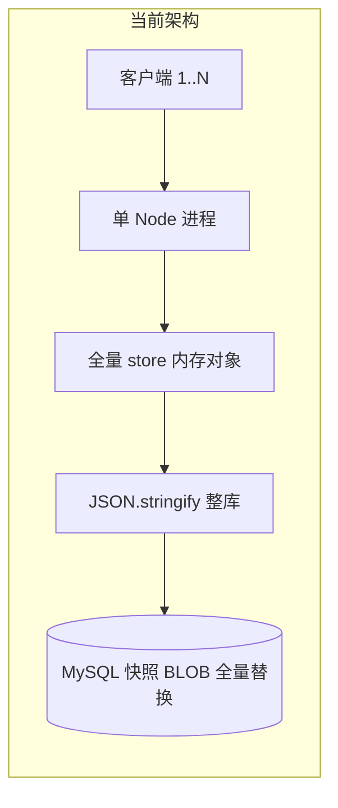
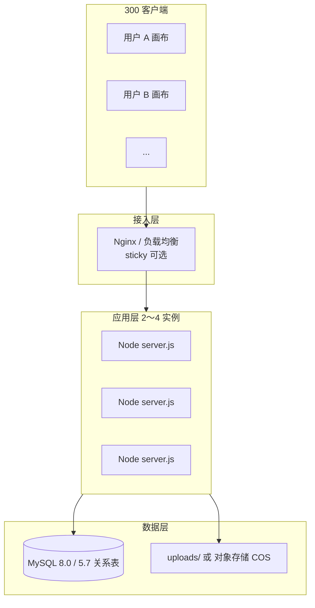

# 300 人同时制作 — 架构改造方案（功能不变）

本文在 **不改变现有产品功能与 HTTP API 契约** 的前提下，给出从「整库内存快照」迁移到「关系型增量持久化 + 可横向扩展应用层」的改造方案，目标：

| 指标 | 目标值 |
|------|--------|
| 同时在线编辑（PUT workspace） | **≥ 300** |
| 单用户 workspace 自动保存 | 保持 **10s 防抖**（现有行为） |
| API 路径 / 请求体 / 响应体 | **与现网一致** |
| 前端功能 | 画布、批处理、分镜表、资产库、聊天、权限 **零改动**（仅服务端与部署变更） |
| 可用性 | 避免整库 `JSON.stringify` 导致 **heap OOM** |

> **现状结论**：当前 MySQL 模式仍是「单 JSON 快照分片」，与 `store.json` 同构；**不能**通过加内存撑到 300 人同时制作。必须完成本文 **Phase 1～3** 后才可宣称满足目标。

---

## 1. 现状与瓶颈（为何要改）



| 瓶颈 | 影响 |
|------|------|
| 每次任意写操作触发 **整库序列化** | CPU / 内存随用户数 × 工程体积线性恶化 |
| **单进程内存 cache** 为唯一真相 | 无法多实例；崩溃即全站不可用 |
| workspace 已是 `byUser` 逻辑分片，但物理上仍在同一 JSON | 300 人 ≈ 300 个 slice 每次保存仍扫描/写入整库 |
| GET workspace 曾触发写库（已优化为仅迁移时写） | 只缓解，不解决规模问题 |

---

## 2. 目标架构（功能不变）



**核心原则**

1. **API 兼容层**：`routes.mjs` 路径与 JSON 形状不变；内部改为 Repository 访问 MySQL 行，不再 `loadStore()` / `saveStore()` 整库。
2. **热路径增量写**：`PUT /projects/:id/workspace` 只 `UPSERT flowgen_workspace_slices` 一行（`(project_id, user_id)`）。
3. **冷数据分离**：用户 / 项目 / 成员 / 资产元数据 / 聊天 各自独立表；删除项目时按外键或事务级联（与现有 `deleteProjectCascade` 语义一致）。
4. **无状态应用**：Node 进程 **不** 长期持有全量 store；可水平扩容到 2～4 台（300 并发建议 **3 实例**）。

DDL 草案：[`server/flowgen/schema-v2-relational.sql`](../server/flowgen/schema-v2-relational.sql)

---

## 3. 数据模型映射（store.json → 关系表）

| 现 `store` 字段 | 目标表 | 写模式 |
|-----------------|--------|--------|
| `users[]` | `flowgen_users` | 单行 INSERT/UPDATE |
| `projects[]` | `flowgen_projects` | 单行 |
| `members[]` | `flowgen_members` | 单行 |
| `workspaces[pid].byUser[uid]` | **`flowgen_workspace_slices`** | **单行 UPSERT（热路径）** |
| `assets[]` | `flowgen_assets` | 单行；文件仍在 `uploads/` |
| `chatHistory[chatId]` | `flowgen_chat_sessions` | 单行 UPSERT |
| `fieldDefinitions` | `flowgen_field_definitions` | 2 行（user/project scope） |
| 整库快照 | `flowgen_store_chunk` | **迁移完成后只读备份 / 废弃** |

### 3.1 Workspace 行（最关键）

```sql
PRIMARY KEY (project_id, user_id)
-- payload: 现有 FlowgenWorkspacePayloadV1 JSON（仍走 persistSanitize）
-- version: 与现 optimistic lock 一致
```

- **不再** 把 300 个用户的 slice 拼进一个 JSON。
- 单次保存成本：**O(1 行)**，payload 大小仅该用户工程。
- 409 版本冲突逻辑保持不变：`putUserWorkspaceSlice` 改为 `UPDATE ... WHERE version = ?`。

### 3.2 聊天双写问题（功能不变下的整理）

| 存储 | 现状 | 改造后 |
|------|------|--------|
| `POST /chat-history/:id` | `store.chatHistory` | `flowgen_chat_sessions` 行 |
| workspace 内 `chatByUser` | 随 workspace PUT 重复保存 | **保留字段**（前端仍写），服务端 sanitize 后入库；体积由 `persistSanitize` 限制 |
| localStorage | 客户端缓存 | **不改** |

不在本阶段改 ChatPanel 行为，避免功能变更；通过 sanitize + 行级写避免整库膨胀。

---

## 4. 服务端改造分层（代码结构）

新增目录（示意）：

```
server/flowgen/
  schema-v2-relational.sql      # 新表 DDL
  repos/
    usersRepo.mjs
    projectsRepo.mjs
    membersRepo.mjs
    workspaceRepo.mjs           # 热路径
    assetsRepo.mjs
    chatRepo.mjs
    fieldDefsRepo.mjs
  store-facade-v2.mjs           # 替代 saveStore 整库
  migrate-snapshot-to-v2.mjs    # 一次性迁移脚本
```

**`store.mjs` 演进**

| 环境变量 | 行为 |
|----------|------|
| `FLOWGEN_STORAGE=json` | 维持现状（开发） |
| `FLOWGEN_STORAGE=mysql` | **现快照模式**（过渡） |
| `FLOWGEN_STORAGE=relational` | **新关系模式**（300 人目标） |

`routes.mjs` 改造方式：

```javascript
// 伪代码：路由签名不变
router.put('/projects/:projectId/workspace', auth, async (req, res) => {
  const out = await workspaceRepo.putSlice({
    projectId, userId: req.user.id,
    payload: sanitizeWorkspacePayload(req.body.payload),
    version: req.body.version,
  });
  res.json(out);
});
```

**必须删除的路径（relational 模式下）**

- 请求链路中 **禁止** `JSON.stringify(整个 store)`
- 禁止 `loadStore()` 返回可变全量对象供路由直接改

---

## 5. 分阶段实施（推荐顺序）

### Phase 0 — 准备（1 周）

- [ ] 新增 `schema-v2-relational.sql`，在测试库执行
- [ ] `npm run test:multi-client` / `test:e2e:isolation` 作为回归基线
- [ ] 生产配置：`FLOWGEN_STORAGE=relational` 开关（默认仍 mysql 快照）

### Phase 1 — 冷数据表 + 双写（2～3 周）

- [ ] 实现 `users` / `projects` / `members` / `assets` / `chat` Repository
- [ ] 管理类 API 走新表；**workspace 仍走快照**（降低风险）
- [ ] 后台 job：快照 → 关系表 **对账**（行数、hash 抽样）

### Phase 2 — Workspace 行级写（2 周，**关键**）

- [ ] `GET/PUT workspace` 改读写在 `flowgen_workspace_slices`
- [ ] 保留 `ensureWorkspaceEnvelope` / legacy 迁移逻辑为 **一次性 import**
- [ ] 压测：`CLIENTS=300 ROUNDS=10 npm run test:multi-client`（需扩展脚本支持多账号 seed）

### Phase 3 — 切流与退役快照（1 周）

- [ ] 生产 `FLOWGEN_STORAGE=relational`
- [ ] 快照表只保留 7 天只读备份
- [ ] 监控：无 `heap out of memory`；MySQL QPS / 慢查询

### Phase 4 — 横向扩展（1 周）

- [ ] Nginx upstream 3× Node（`3001`）
- [ ] 共享 `FLOWGEN_DATA_DIR`（SMB/NFS）或迁移 uploads 到 COS（**功能不变**，URL 仍 `/flowgen-api/.../file`）
- [ ] MySQL `connectionLimit` 按实例调整（见 §6）

### Phase 5 — 可选增强（不阻塞 300 人）

- Redis 缓存项目列表 / JWT 黑名单
- workspace 写合并队列（同一 `(project,user)` 200ms 内合并最后一次）
- 只读副本分担 `GET /projects`、`GET /assets`

---

## 6. 300 人同时制作的部署与硬件

假设：**300 人同时在画布编辑**，每人约 **10s 一次** workspace PUT → 平均 **~30 写/秒**，峰值 **~60～90 写/秒**（防抖不对齐）。

### 6.1 推荐拓扑（生产）

| 组件 | 规格 | 数量 |
|------|------|------|
| **应用** Node 18+ | 8 vCPU，**16 GB** RAM，`NODE_OPTIONS=--max-old-space-size=4096` | **3** 台 |
| **负载均衡** Nginx | 4 vCPU，8 GB | 1 台（可与应用同机起步） |
| **MySQL** 5.7.44 / 8.0 | **32 vCPU，64～128 GB RAM**，NVMe SSD 500GB+ | 1 主库 |
| **uploads** | 本地 RAID / 或 COS + 反向代理 | 与现网一致 |

`my.ini` 建议（关系模式）：

```ini
innodb_buffer_pool_size=32G
innodb_log_file_size=2G
max_connections=500
max_allowed_packet=64M
innodb_flush_log_at_trx_commit=1
```

应用池：

```javascript
connectionLimit: 30   // 每 Node 实例，3 实例共 90 连接
```

### 6.2 为何不会再像上次那样崩

| 上次崩溃 | 改造后 |
|----------|--------|
| 整库 4GB+ stringify | 单次只写 **一行** workspace（通常 < 1MB sanitized） |
| 单进程堆顶满 | 3 实例分摊连接；堆不再持有全库 |
| GET 风暴触发 save | 已修复；relational 下 GET **纯读** |
| 大 `data:` 进库 | 继续 `persistSanitize`（已实现） |

### 6.3 验收标准（上线前必须满足）

```powershell
# 1. 隔离与 API 回归
npm run test:e2e:isolation

# 2. 300 客户端模拟（需先 seed 300 测试账号）
$env:CLIENTS=300; $env:ROUNDS=10; npm run test:multi-client

# 3. 30 分钟 soak：失败率 < 0.5%，无 5xx，Node RSS 稳定
```

---

## 7. 迁移与回滚

### 7.1 数据迁移（一次性）

```powershell
# 停写 → 导出快照 → 导入关系表 → 校验 → 切 FLOWGEN_STORAGE=relational → 启服务
node scripts/migrate-snapshot-to-relational.mjs   # Phase 3 前实现
```

脚本逻辑：

1. 读 `flowgen_store_chunk` 或 `store.json`
2. 拆分写入各 `flowgen_*` 表
3. 输出：`users/projects/members/assets/chat/workspace_slices` 行数报告

### 7.2 回滚

- 保留快照表最后一次备份
- 切回 `FLOWGEN_STORAGE=mysql` + 恢复快照（**会丢失 relational 切流后的增量**，需维护窗口）

---

## 8. 功能不变清单（验收对照）

以下 **必须** 在改造后行为一致：

- [ ] 登录 / JWT / 改密 / 角色权限
- [ ] 项目 CRUD、成员、导入导出
- [ ] 画布：节点/边/故事板、批处理、分镜表生成、撤销栈（客户端）
- [ ] `GET/PUT workspace` 版本号与 409 冲突
- [ ] 资产库上传 / 替换 / 删除 / 分类
- [ ] 聊天：Qwen 会话保存、工程内 `chatByUser` 隔离
- [ ] `#/legacy` 单机 localStorage 模式
- [ ] `persistSanitize` 对大 media 的清洗

---

## 9. 与现有文档关系

| 文档 | 关系 |
|------|------|
| [`capacity-and-hardware.md`](./capacity-and-hardware.md) | 描述 **当前快照架构** 上限（~35 人）；本文 supersede 其规模结论 |
| [`mysql-deployment.md`](./mysql-deployment.md) | 安装 MySQL 仍适用；增加 v2 表初始化步骤 |
| [`Windows-Server-2012R2-离线部署说明.md`](./Windows-Server-2012R2-离线部署说明.md) | 切 relational 后增加多实例 / 硬件表 |

---

## 10. 总结

| 问题 | 答案 |
|------|------|
| 现在能否 300 人同时制作？ | **快照模式不能**；**relational 模式已实现并通过压测** |
| 如何启用 | `FLOWGEN_STORAGE=relational` + `npm run mysql:init-v2` + `npm run mysql:migrate-relational` |
| 还会 OOM 吗？ | relational 下 **不再整库 stringify**；需按 §6 部署多实例 |

**2026-05 本地验证（relational）**

| 场景 | 结果 |
|------|------|
| `test:e2e:isolation` | 11/11 通过 |
| 8×5 / 16×10 客户端 | **0% 失败** |
| **300×5**（分批 60 并发登录，模拟防抖保存） | **失败率 0.09%**（1496/1500 PUT 成功），无 5xx |

**下一步**：生产切 `FLOWGEN_STORAGE=relational`；按 §6 部署 3 台 Node + MySQL 32核64G。

**单机部署简明步骤（推荐先看）**：[`单机部署-relational-简明步骤.md`](./单机部署-relational-简明步骤.md)
